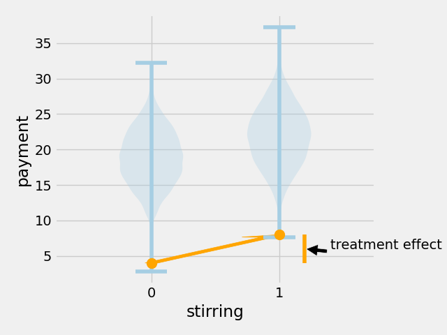
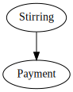

# Causal Inference Libraries: What They Do and What I'd Like Them to Do

## Kevin Klein, QuantCo


---

# Agenda

1. Why Causal Inference?
2. Why care about heterogeneity?
3. How can we estimate heterogeneous treatment effects on paper?
4. How can we estimate heterogeneous treatment effects in practice?
5. What am I missing from `EconML` and `CausalML`?

---

# Risotto


- Risotto can either be prepared
  - in a laborous and delicate fashion, involving a lot of
    **stirring** or
  - in a cut-throat, cantine style fashion, **not** involving a lot of
    **stirring**
- Consumers of risotto are **free to decide how much they pay** for
  their risotto.
- Naturally we wonder: should we be stirring?

---

# 1. Why care about Causal Inference?

---

# Intervention

What happens when we intervene on a data point from the left,
i.e. `stirring = 0`, and now - keeping everything else unchanged - make sure that a gas stove is used, i.e. `stirring = 1`?


---

## What happens if we intervene?

<p float="left" align="middle">
  
  
</p>

---

## It depends

 

---

# 2. Why care about heterogeneity?

---

## The treatment effects: a histogram


---

## To stir or not to stir, the maths

- Assume that the cost of stirring amounts to 1$ per unit.
- Also assume that the overall revenue when never stirring is $R$.
- Then, the overall revenue when **always stirring** is $R - n \cdot 1 +
  \delta_1$
  - The plot from the previous slide tells us that $n \cdot 1 > \delta$.
- The overrall revenue of **stirring when we expect it to pay off**: $R - k \cdot 1 +
  \delta_{\pi}$
  - We can condition on certain 'covariates'/features to decide for whom it
    pays off.
  - When doing this 'right', we get that $\delta_{\pi} > k \cdot 1$.

<!-- TODO: Use colors. -->

---

## From treatment effect to policy


---

## From treatment effect to policy


$$
\pi(X) := \begin{cases}
    \text{stir} & \text{if } \hat{\tau}(X) \geq 1\text{USD}\\
    \text{don't stir}              & \text{otherwise}
\end{cases}
$$

---

## From treatment effect to policy

$$
\pi(X) := \begin{cases}
    \text{stir} ,& \text{if } \hat{\tau}(X) \geq 1\\
    \text{don't stir},              & \text{otherwise}
\end{cases}
$$

---

# 3. Estimating heterogeneity on paper

---

## The fundamental problem of Causal Inference

Desire

| Consumer | Age of consumer | ... | Non-stirred outcome/payment | Stirred outcome/payment | Individual treatment effect |
| -------- | --------------- | --- | --------------------------- | ----------------------- | --------------------------- |
| Bob      | 28              | ... | 21                          | 21.8                    | .8                          |
| Anne     | 10              | ... | 12                          | 12                      | 0                           |

---

## The fundamental problem of Causal Inference

Reality

| Consumer | Age of consumer | ... | Non-stirred outcome/payment | Stirred outcome/payment | Individual treatment effect |
| -------- | --------------- | --- | --------------------------- | ----------------------- | --------------------------- |
| Bob      | 28              | ... | 21                          | ?                       | ?                           |
| Anne     | 10              | ... | ?                           | 12                      | ?                           |

---

## What now?

- We can't know the Individual Treatment Effect (ITE).
- Yet, we can define an estimand, the Conditional Average Treatment Effect
  (CATE), which we can actually estimate:
  $\tau(X) := \mathbb{E}[\text{payment}|X\text{, stirring}] -
  \mathbb{E}[\text{payment}|X\text{, no stirring}]$

---

## Conventional assumptions for estimating heterogeneous treatment effects

- Positivity/overlap
- Conditional ignorability/unconfoundedness
- Stable Unit Treatment Value (SUTVA)

A randomized control trial usually gives us the first two for free.

---

## MetaLearners

- MetaLearners are CATE models which rely on typical, arbitrary machine learning
  estimators (classifiers or regressors) as components. Their output
  is an estimate of the heterogeneous treatment effect.
- An simple, intuitive, yet often somewhat disappointing MetaLearner
  is the T-Learner: $\hat{\tau}(X) = \mu_1(X) - \mu_0(X)$
- Other examples include the S-Learner, F-Learner, X-Learner, R-Learner,
  M-Learner, DR-Learner

---

## The T-Learner


<!-- TODO: Create my own visualization. -->

---

# 4. Estimating heterogeneity in practice

---

## The open-source libraries for CATE estimation

|                            | `EconML`                  | `CausalML`      |
| -------------------------- | ------------------------- | --------------- |
| Developed by               | MSR/py-why                | Uber            |
| License                    | MIT                       | Apache 2.0      |
| \#releases in past 2 years | 4                         | 7               |
| Features                   | CATE estimation           | CATE estimation |
|                            | direct policy learnig     |                 |
|                            | Inference (e.g. p-values) |                 |
| MetaLearner API            | sklearn                   | sklearn         |

<!-- TODO: Talk about features -->

---

## Risotto consumption: a simulation


---

## Risotto consumption: a simulation

|    age | nationality | chef_rating | gas_stove | $\mu$ | $T$ | $\tau$ |   $Y$ |
| -----: | :---------- | ----------: | --------: | ----: | --: | -----: | ----: |
|  50.77 | Indonesia   |        0.53 |         1 | 20.73 |   1 |   0.34 | 21.08 |
|  59.48 | Iraq        |        0.46 |         0 | 20.46 |   0 |   0.76 | 20.46 |
|  47.25 | India       |        0.46 |         0 | 24.29 |   0 |   0.19 | 24.29 |
|  22.21 | Italy       |        0.58 |         0 | 15.90 |   1 |   0.88 | 16.79 |
| 100.40 | India       |        0.58 |         1 | 29.95 |   1 |   0.30 | 30.25 |

$\mu(X) \equiv$ the 'base outcome', i.e. outcome/payment without stirring
$T \equiv$ the treatment, whether the risotto has been stirred or not
$\tau(X) \equiv$ the heterogeneous treatment effect
$Y \equiv$ the outcome, the final payment
$Y = \mu(X) + T \cdot \tau(X)$

<!-- TODO: Stress which columns wouldn't usually be available in a -->
<!-- non-simulated context -->

---

## Training a CATE model with `CausalML`

```python
# One-hot encoding
X = pd.concat([
    df[numerical_covariates],
    pd.get_dummies(df["nationality"])
], axis=1)

# Model definition
reg = lgbm.LGBMRegressor()
clf = lgbm.LGBMClassifier()
model = causalml.BaseRRegressor(
    outcome_learner=reg,
    effect_learner=reg,
    propensity_learner=clf,
)

# Model training and prediction
model.fit(X=X, treatment=df[treatment], y=df[outcome])
cate_estimates = model.predict(X)
```

---

## CATE estimation results


---

# 5. Pains and problems in practice ($P^3$)

---

## $P^3$\#1: Categorical features

- `lightgbm` is a very popular choice for prediction on tabular
  datasets.
- In particular, it hat native support for working with categorical features.
  E.g. instead of having to one-hot encode categoricals, one can indicate that a column
  is to be treated as a categorical.

---


---


---

## How can we actually use these categoricals?

- Option 1: Use `pandas` `category` dtype

  ```python
  df["nationality"] = df["nationality"].astype("category")
  model = lgbm.LGBMRegressor()
  model.fit(df[["nationality"]], df["payment"])
  ```

- Option 2: Explicitly set `categorical_indices`
  ```python
  df["nationality"] = df["nationality"].astype("category").cat.codes
  model = lgbm.LGBMRegressor(categorical_feature=[0])
  model.fit(df[["nationality"]], df["payment"])
  ```

---

- Unfortunately, both options don't work with `causalml` and `econml`.
- Option 1 is not possible since both convert `pandas` input to `numpy`
  objects in a 'validation' step.
  - `X, treatment, y = convert_pd_to_np(X, treatment, y)`
  - https://github.com/uber/causalml/blob/3b3daaa3cd2ef1960028908c152cfd242b37712c/causalml/inference/meta/rlearner.py#L100
- Option 2 is not possible since constructor parameters can't be
  passed.

---

- A hack is - of course - possible to indirectly use option 2:
  ```python
  from functools import partialmethod
  from lightgbm import LGBMRegressor
  LGBMRegressor.fit = partialmethod(
    LGBMRegressor.fit,
    categorical_feature=[0],
  )
  ```

---

## Tying back to our example: what's the difference?


---

## $P^3$ \#2: Reusing component models

- There are many free parameters when training meta learners:

  1. Choose which meta learner (e.g. R-Learner)
     - This is hard, see [Curth, van der Schar (2021)](https://proceedings.mlr.press/v130/curth21a.html)
  2. Per estimand, choose an estimator (e.g. boosted trees)
  3. Per estimator

  - per hyperparameter (e.g. depth), choose a value (e.g.12)

- In practice, this often boils down to 'trying out' different
  constellations, e.g. via random search or grid search.

- See [EconML issue 646](https://github.com/py-why/EconML/issues/646).

---

## A MetaLearner


---

## A MetaLearner


---

## The R-Learner


---

## The R-Learner


---

## The R-Learner: Hyperparameter tuning


---

## The R-Learner: Hyperparameter tuning


---

## The R-Learner: Hyperparameter tuning


- We can expect a ~threefold increase of runtime due to not being able to train and reuse component models in isolation.
- This is even amplified when trying to use a particular component model for other MetaLearners, too.

---

## $P^3$ \#3: Distinct covariate sets

- Different covariates for different components
  - E.g. we know that the treatment effect is only a function of stirring while the base outcome is a function of many features.
- Different covariates for different treatments
  - E.g. assume we have the following treatment variants:
  1.  No stirring
  2.  Stirring for 20'
  3.  Stirring for 40'
  - where the second and third variant have the additional covariate of the spoon type. We would like to use that covariant to capture heterogeneity, but can't specify that we only have it for specific variants.
- These features are not at all supported by EconML and CausalML.

---

## And more...

- DoubleML: Biased final stage
- Tricky to combine cross-fitting with further cross-splitting
  (e.g. super learning or splits) -> also an engineering problem
  (e.g. multiprocessing)
- Read out treatment effects of categoricals when using DML

---

# Do you also prefer Causal Inference and critizing libraries over doing pretty slides?

Join us :)
https://www.quantco.com/


---


---

# Acknowledgements

- Matheus Facure: [Causal Inference for the Brave and True](https://matheusfacure.github.io/python-causality-handbook/landing-page.html)
- Matthias Lux, Norbert Stoop
